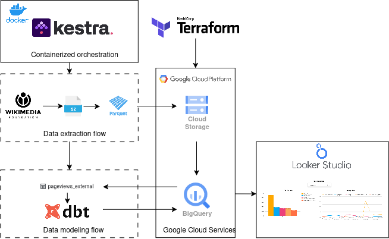
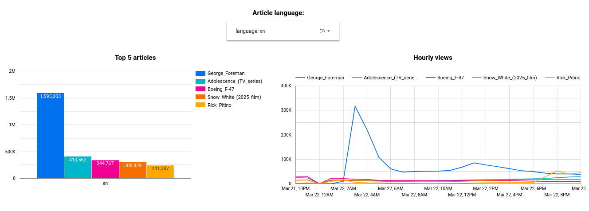

# Introduction
This project demonstrates how open data can be leveraged to build scalable, cloud-native solutions for real-world use cases like news and media monitoring, trend detection, content recommendation, and public interest analytics. It implements a data pipeline that ingests Wikimedia Pageviews data, parses it into a structured table, and stores it in .parquet format for efficient querying. The pipeline performs hourly analysis on the top page views per language and tracks their 24-hour trends. The workflow is orchestrated by Kestra, with data stored in Google Cloud Storage (GCS) and transformed using Data Build Tool (DBT) in BigQuery for analysis. Infrastructure is provisioned using Terraform, and the pipeline runs in a containerized environment with Docker Compose, including a local Postgres instance for workflow metadata.

## Key components

### Terraform
Automates the provisioning and management of the cloud infrastructure. In this project its used to Create a Google Cloud Storage bucket and a BigQuery dataset.

### Google Cloud Storage (GCS):
Stores the parquet-formatted pageview data downloaded by Kestra.

### BigQuery
Used for data warehousing. Holds analysis-ready tables created by DBT

### Kestra:
Manages the hourly job that downloads data from Wikimedia into a GCS bucket, then triggers DBT to load data into BigQuery.

### Data Build Tool (DBT):
Handles SQL-based data transformations and modeling, turning the data loaded into the GCS bucket into analysis-ready tables in BigQuery.

### Postgres:
Runs in a container alongside Kestra for metadata.

### Docker Compose
To run both Kestra and Postgres containers, and to ensure an isolated environment that’s easy to spin up or tear down.

## Project architecture

# Running this project
### Prerequisites
* A Google Cloud Platform project named wikimedia-pageviews
* A service account with permission to create buckets and BigQuery datasets. For reference, the following roles where set:
    * BigQuery Data Editor
    * BigQuery User
    * Storage Admin
* A service account JSON key. This needs to be placed in terraform/keys/ with the name my-credentials.json

### Steps
#### 1. Clone the repository and access the project directory: 

```bash
 git clone https://github.com/CMPablos/wikimedia-pageviews-analysis.git
 cd wikimedia-pageviews-analysis
```

#### 2. Deploy the infrastructure with Terraform:

```bash
    cd terraform
    terraform init
    terraform plan
    terraform apply
```

This creates the required bucket and BigQuery dataset in wikimedia-pageviews

#### 3. Run Docker Compose
Go back to the project root directory and then:

```bash
   cd kestra
   docker-compose up -d
```

This builds and runs the Kestra and Postgres containers. 

#### 4. Start the kestra flow for data collection

* Open the kestra GUI in a browser at http://127.0.0.1:8080/
* Go to the Flows tab on the left side.
* Look for a flow named pageviews-data.
* (Optional) By default the hourly scheduler is turned off. In order to enable it, click on the 'Edit flow' button at the top right corner. Under the triggers section at the bottom of the file, change the disabled flag to true. You may also change the number of files to be downloaded per run, by default the quantity is set to 24 (to get the last 24 hours of data).
* Hit the execute button at the top right corner to begin extracting data from Wikimedia.
* The dbt-transformation-flow is automatically triggered to create the data analysis tables in bigquery once the pageviews-data flow finished downloading and parsing all the pageviews files 

When both flows have completed, you’ll find the pageviews Parquet files in the wikimedia-pageviews-bucket and see the following tables created under the pageviewsDataset in BigQuery.


#### 5. Build a dashboard for Top 5 article visualization per language

* Go to Looker Studio (https://lookerstudio.google.com/)
* On the Looker Studio landing page, click + Blank Report (or Create -> Report)
* Select Add data
* From the list of connectors, select BigQuery and look for the wikimedia-pageviews project, then the pageviewsDataset and select the top_by_language table
* Go to Add data again from the toolbar and repeat the step above, this time selecting the top_pages_hourly table
* Add each element of the dashboard:
    * Bar Chart(Top 5)
        * Insert a bar chart
        * Select top_by_language as a data source
        * Dimension: page_title; Metric: views.
    * Time-Series(Hourly Views)
        * Insert a time series chart
        * Data Source: top_pages_hourly.
        * Dimension: date; Breakdown Dimension: page_title; Metric: views (sum)
    * Language Filter
        * Insert a drop-down list from the Add a Control menu
        * As a data source select top_by_language
        * in the Style tab, under Control select Single-select


